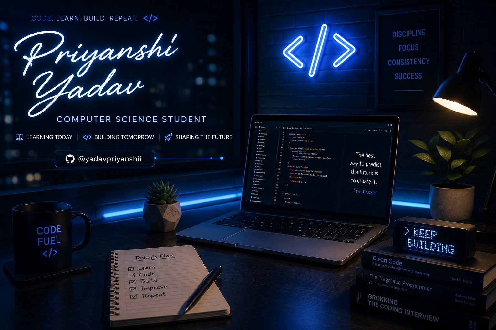

<div align="center">

<p align="center">
  
</p>

<a href="https://git.io/typing-svg">
  
</a>

<br/>


<br/>


</div>

```typescript
const priyanshi = {
  role: "Computer Science Student",
  currentlyLearning: [
    "C++",
    "Data Structures & Algorithms",
    "HTML",
    "CSS",
    "JavaScript"
  ],
  interests: [
    "Frontend Development",
    "Open Source",
    "Problem Solving"
  ],
  goals: [
    "Build impactful projects",
    "Contribute to Open Source",
    "Secure a Software Development Internship"
  ],
  openTo: "Internships & Collaboration"
};
```


## 🛠️ Tech Stack

**Languages**


**Frontend**


**Tools**


## 🌱 Learning Roadmap

- ✅ HTML
- ✅ CSS
- ✅ JavaScript Basics
- 🔄 React
- 🔄 SQL
- 🔄 Git
- 🔄 Node.js

## ⭐ Featured Projects

| Project | Description | Tech |
|----------|-------------|------|
| Portfolio Website | Personal Portfolio | HTML CSS JS |
| Weather App | Weather using API | JavaScript |
| Calculator | Responsive Calculator | HTML CSS JS |


## 📊 GitHub Stats

<div align="center">


</div>

## 🏆 Trophies

<div align="center">

</div>

## 📈 Contribution Activity

<div align="center">

</div>

## 🐍 Contribution Snake

<p align="center">

</p>

## ⚡ Fun Facts

- 💙 Love building beautiful websites
- 📚 Learning something new every day
- 🚀 Goal: Become a Full-Stack Developer

## 🤝 Connect With Me

<div align="center">

[](https://www.linkedin.com/in/priyanshi-092246361)

</div>


